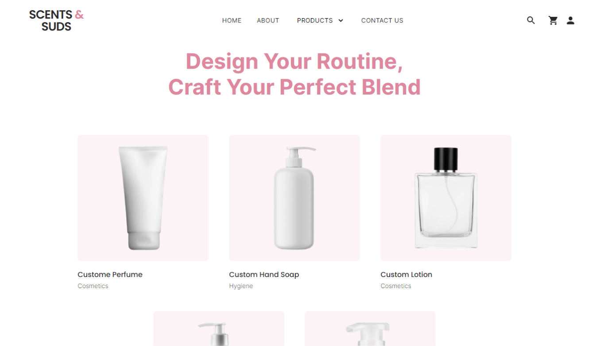
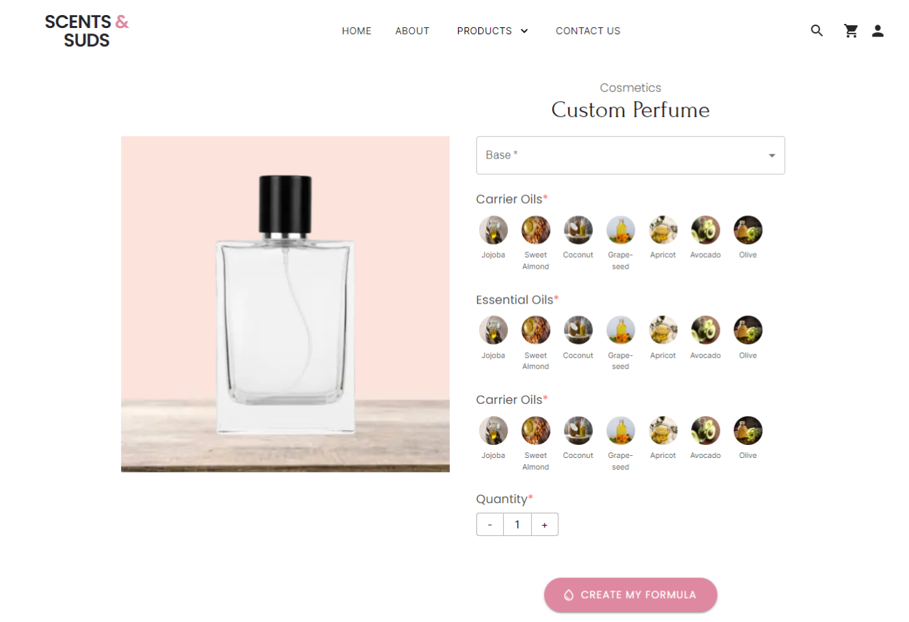

# Scents & Suds

<!-- 
 -->

## Getting Started

In order to run this project you need to start both the client and the server.

### Prerequisites

NPM / Yarn and Node.js installed

Execute these commands from the project directory

## Start API

1. `cd server`
2. `npm install`
3. `npm start`

## Start Client

1. `cd client`
2. `npm install`
3. `npm install @mui/styles --save --force`
4. `npx prisma migrate dev`
5. `npm run dev`

Access the web app at http://localhost:3000/
